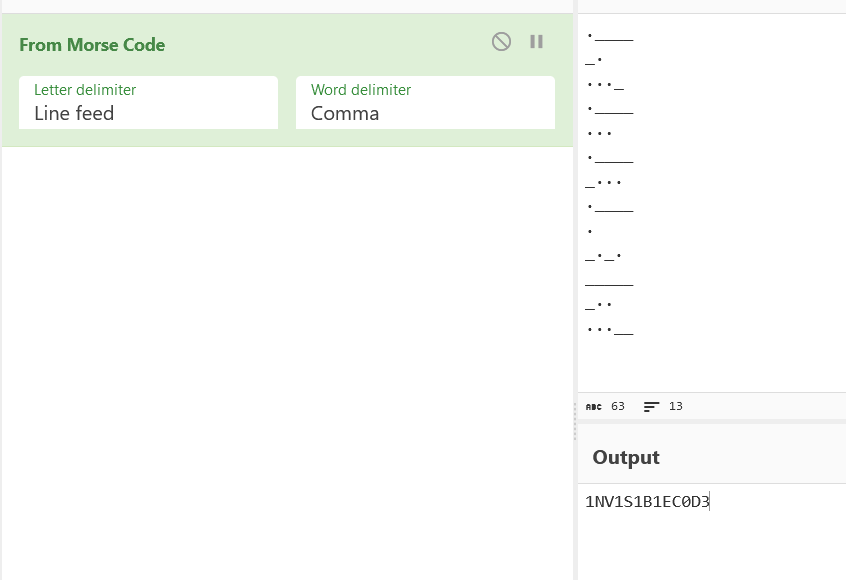

# Invisibility

```
It seems that there is a message from the post-dystopian scientist.
Find a way to read the message.
The message is the flag. E.g. LNC2023{message}
```

solves: *38* <br>

files given
- [Invisibility.txt](./Invisibility.txt)

`file` tells us that this is an ASCII txt file
```
└─$ file Invisibility.txt
Invisibility.txt: ASCII text, with CRLF line terminators
```
However, when we try to read it, we see nothing
```
└─$ cat Invisibility.txt


                ┌──(duck@duck)-
```
Is it nothing tho? It seems that it's printing an output, but we just cant see it \
Lets look at it's hexdump
```

└─$ xxd Invisibility.txt
00000000: 2009 0909 090d 0a09 200d 0a20 2020 090d   ....... ..   ..
00000010: 0a20 0909 0909 0d0a 2020 200d 0a20 0909  . ......   .. ..
00000020: 0909 0d0a 0920 2020 0d0a 2009 0909 090d  .....   .. .....
00000030: 0a20 0d0a 0920 0920 0d0a 0909 0909 090d  . ... . ........
00000040: 0a09 2020 0d0a 2020 2009 09              ..  ..   ..
```
This shows many `0x20` and `0x09` hex values, with `0x0d` and `0x0a` sprinkled around[^1]
- `0x20`: space
- `0x09`: '\t' or tab
- `0x0d`: '\r' or carriage return
- `0x0a`: '\n' or linefeed 
<br>
Now, note that '\r' and '\n' is back to back. This is known as CRLF[^2] \
I made a small program in C [print.c](./print.c) to read the values of the file, and print it out, with the spaces being converted to `.` and tabs being converted to `-`[^3] \
output:
```
└─$ ./a.out
.____
_.
..._
.____
...
.____
_...
.____
.
_._.
_____
_..
...__
```
Putting this into Cyberchef and decoding it, we get the message! \
 <br>

FLAG: `LNC2023{1NV1S1B1EC0D3}`


[^1]: You can try seeing the values yourself by doing the command `printf "\t \r\n" | xxd` and looking at the output!
[^2]: CRLF(Carriage Return Line Feed) is Windows specific. While in unix systems denote a newline with just '\n', Windows denotes newlines as '\r\n'. Hence the name. You can read more about newlines here: https://en.wikipedia.org/wiki/Newline
[^3]: Why I did this is because while spaces take up a fixed amount of space, tabs can usually take up a lot a lot more vertial width, hence it makes sense that it'll be longer
