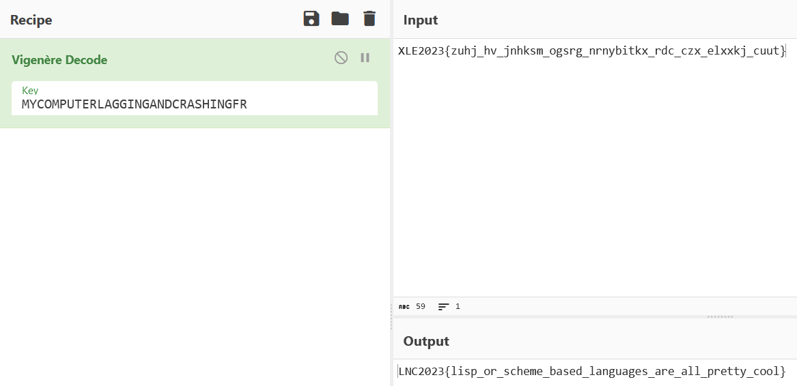

# Tennis Rookie

```
I can never figure out which hand to hold my racket in
```

connection info: `nc nc.lagncra.sh 8008` \

This gives us a Racket shell.
```
Welcome to Racket v7.2.
> ls
> a
> help
Sending to web browser...
  file: /usr/share/doc/racket/index.html
> whoami
> al
> ?
> *
#<procedure:*>
> ./*
> ls
> al
> afl
> (apply + '(1 2 3))
6
```
If it wasn't obvious here, I didn't know what I was doing. I have 0 experience with the Racket Programming language. \
Howver, not all is lost. I asked chatGPT to generate some code to list files, and got this
```
> (require file)

(define files (directory-list "."))

(for-each displayln files)
> > .dockerenv
bin
boot
dev
etc
flag
home
key
lib
lib32
lib64
libx32
media
mnt
opt
proc
root
run
sbin
srv
sys
tmp
usr
var
```
There are some interesting files here. Most notably `flag` and `key`. \
```
> (define file (open-input-file "flag"))

(let loop ((line (read-line file)))
  (cond
    ((eof-object? line)
     (close-input-port file))
    (else
     (displayln line)
     (loop (read-line file)))))>
XLE2023{zuhj_hv_jnhksm_ogsrg_nrnybitkx_rdc_czx_elxxkj_cuut}
```
This looks quite similar to the flag, but it seems to have been encrypted in some cipher.
```
> (define file (open-input-file "key"))

(let loop ((line (read-line file)))
  (cond
    ((eof-object? line)
     (close-input-port file))
    (else
     (displayln line)
     (loop (read-line file)))))>
MYCOMPUTERLAGGINGANDCRASHINGFR
```
This is actually encryped using the [Vigenère cipher](https://en.wikipedia.org/wiki/Vigen%C3%A8re_cipher). A cipher that utilizes a key in it's encryption scheme



FLAG: `LNC2023{lisp_or_scheme_based_languages_are_all_pretty_cool}`
