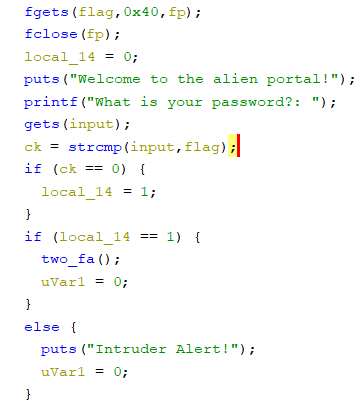
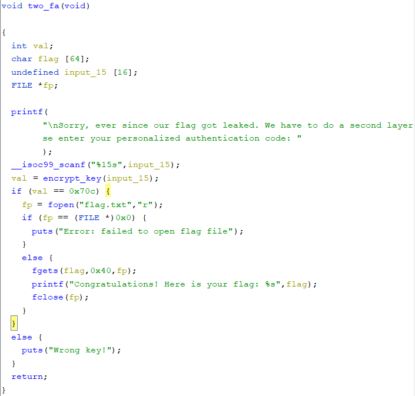
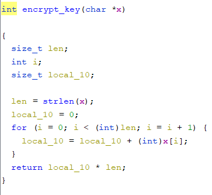

# Alien Portal

```
The fate of humanity rests in your hands.
We've managed to infiltrate an alien login portal, and we believe that they're hiding a flag in there.
Can you help us get in?
```
solves: *7* <br>
files given
- [vuln.exe](./vuln.exe)

`file` output
```sh
└─$ file vuln.exe
vuln.exe: ELF 32-bit LSB executable, Intel 80386, version 1 (SYSV), dynamically linked, interpreter /lib/ld-linux.so.2, BuildID[sha1]=9e95f0a128ef480097a01a842b5c645789f2e7e5, for GNU/Linux 3.2.0, not stripped
```
This is a `32bit` executable program <br>

`checksec` output
```sh
    Arch:     i386-32-little
    RELRO:    Partial RELRO
    Stack:    No canary found
    NX:       NX enabled
    PIE:      No PIE (0x8048000)
```
Lets decompile the program <br>
 <br>
It first reads the flag then takes user input. It compares `flag` with the `input`, that is taken in by `gets()` <br>
We are able to abuse `gets` to overwrite the `flag`, `ck`, and `local_14` variables, as well as overwrite the return address \
<br>
Lets run[^1] it on `gdb`, and try to find the offset. I'm using [pwndbg](https://github.com/pwndbg/pwndbg). \
However, when trying to get the offset, I keep getting an error: `<Could not read memory at 0x6175615d>`. It's probably something to do with `32bit` binary shenanigans. \
Luckily, you dont actually need to ret2win in order to solve the challenge. \
<br>
## Defeating `strcmp`
My idea is to defeat the `strcmp` check via overwriting the string. 
```c
int strcmp(const char *cs, const char *ct)
{
	unsigned char c1, c2;

	while (1) {
		c1 = *cs++;
		c2 = *ct++;
		if (c1 != c2)
			return c1 < c2 ? -1 : 1;
		if (!c1)
			break;
	}
	return 0;
}
```
Above is a `strcmp` implementation I found [here](https://elixir.bootlin.com/linux/latest/source/lib/string.c#L276).
Simply explained, it takes `cs` and `ct`, loops through the characters to compare them, and returns `0` if they are the same. the final `if` case leading to the `break` checks for a terminating NULL byte.  
We know that our `input` is only `6` characters long before it overflows to the `flag` variable, so I decided to change the `flag` variable to hold our own input, including the NULL terminating byte.
```py
payload = b'A'*5 + b'\x00' + b'A'*5 + b'\x00';
```
this means that `strcmp` will get two inputs of `AAAAA\x00` and `AAAAA\x00` and compare them[^2]. We dont have to know the length of the actual `flag`, as we are bringing in our own NULL terminating byte.  
## Defeating encrypt_key()
after defeating `strcmp`, we will arrive at this function: \
 <br>
There does not seem to be any vulnerable code here, and just a key check. A look into the `encrypt_key()` function shows what this function actually does  
 <br>
I made a bruteforce script[^3] here [gen.c](./gen.c). What it basically does is that it emulates the `encrypt_key()` function, and searches for values in the ASCII range that allows us to solve the final check.
<br>
The final solve script can be found here: [exp.py](./exp.py) 
```
└─$ python3 exp.py
[+] Opening connection to nc.lagncra.sh on port 8011: Done
b'Welcome to the alien portal!\r\n'
b'AAAAA\x00AAAAA\x00'
/mnt/d/CTFs/lnc/3.0/pwn/Alien Portal/exp.py:15: BytesWarning: Text is not bytes; assuming ASCII, no guarantees. See https://docs.pwntools.com/#bytes
  io.recvuntil('What is your password?: ')
b'}L}}\x00'
/mnt/d/CTFs/lnc/3.0/pwn/Alien Portal/exp.py:19: BytesWarning: Text is not bytes; assuming ASCII, no guarantees. See https://docs.pwntools.com/#bytes
  io.recvuntil('Please enter your personalized authentication code: ')
[*] Switching to interactive mode
Congratulations! Here is your flag: LNC2023{SecreT_Al13n_por7a1?}[*] Got EOF while reading in interactive
$
```

FLAG: `LNC2023{SecreT_Al13n_por7a1?}`

[^1]: When trying to run it, I got: `/mnt/d/CTFs/lnc/3.0/pwn/Alien Portal/vuln.exe: /lib/i386-linux-gnu/libc.so.6: version 'GLIBC_2.34' not found (required by /mnt/d/CTFs/lnc/3.0/pwn/Alien Portal/vuln.exe)` As it turns out, this was compiled for a newer `glibc` then my debian WSL has, so I had to run it on kali... Oh well!

[^2]: In all honesty, I believe that putting `\x00` as the input to overwrite all strings can be a easy way to do it if you dont know the actual offset, but lets aim to be accurate and precise!

[^3]: At first I didn't limit the search space, but after A LOT of fustration(of trying to get it to work on remote[it worked on my machine]), I decided it wouldn't hurt to get some "known good" values in the ASCII space... still no clue what happened there, but hey, the printable ASCII values worked!

