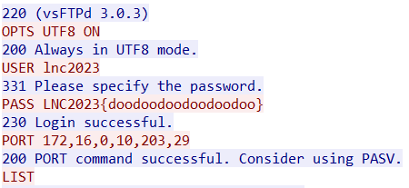

# Baby Shark

```
Shoot, our server is not secure. Hope the humans don't know about this. Time to secure our systems!
```

solves: *77* <br>

files given
- [babyshark.pcapng](./babyshark.pcapng)

```
└─$ file babyshark.pcapng
babyshark.pcapng: pcapng capture file - version 1.0
```
The file got was a pcapng file. I opened it in wireshark, and started off by following the TCP streams. \
At the 5th stream(4th in wireshark), we see this \


FLAG: `LNC2023{doodoodoodoodoodoo}`
