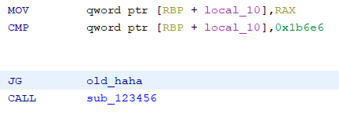
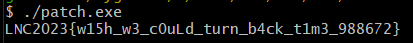

# Time Travel

```
We found this program from the ancient 20th century. I really miss those days...
```
- solves: *19* <br>
This is another easy level reversing challenge \
files given
- [tt.exe](./tt.exe)

This time, running `rabin2 -z` didn't give us the flag
```sh
└─$ rabin2 -z tt.exe
[Strings]
nth paddr      vaddr       len  size section type  string
―――――――――――――――――――――――――――――――――――――――――――――――――――――――――
0   0x00001020 0x100402020 26   27   .data   ascii STRINGSCANTSOLVEEVERYTHING
1   0x00001043 0x100402043 6    7    .data   ascii {~u`86
2   0x00001054 0x100402054 11   12   .data   ascii =\v<<<)\f6f*%
3   0x00001060 0x100402060 12   13   .data   ascii 'r,}\vjwt`rw+
0   0x00001200 0x100403000 24   25   .rdata  ascii You're too old for this!
1   0x00001220 0x100403020 49   50   .rdata  ascii GCC: (GNU) 9.3.0 20200312 (Fedora Cygwin 9.3.0-1)
2   0x00001260 0x100403060 17   18   .rdata  ascii GCC: (GNU) 10.2.0
3   0x00001280 0x100403080 17   18   .rdata  ascii GCC: (GNU) 10.2.0
4   0x000012a0 0x1004030a0 49   50   .rdata  ascii GCC: (GNU) 9.3.0 20200312 (Fedora Cygwin 9.3.0-1)
5   0x000012e0 0x1004030e0 49   50   .rdata  ascii GCC: (GNU) 9.3.0 20200312 (Fedora Cygwin 9.3.0-1)
6   0x00001320 0x100403120 49   50   .rdata  ascii GCC: (GNU) 9.3.0 20200312 (Fedora Cygwin 9.3.0-1)
7   0x00001360 0x100403160 49   50   .rdata  ascii GCC: (GNU) 9.3.0 20200312 (Fedora Cygwin 9.3.0-1)
8   0x000013a0 0x1004031a0 49   50   .rdata  ascii GCC: (GNU) 9.3.0 20200312 (Fedora Cygwin 9.3.0-1)
9   0x000013e0 0x1004031e0 49   50   .rdata  ascii GCC: (GNU) 9.3.0 20200312 (Fedora Cygwin 9.3.0-1)
10  0x00001420 0x100403220 49   50   .rdata  ascii GCC: (GNU) 9.3.0 20200312 (Fedora Cygwin 9.3.0-1)
11  0x00001460 0x100403260 49   50   .rdata  ascii GCC: (GNU) 9.3.0 20200312 (Fedora Cygwin 9.3.0-1)
12  0x000014a0 0x1004032a0 49   50   .rdata  ascii GCC: (GNU) 9.3.0 20200312 (Fedora Cygwin 9.3.0-1)
13  0x000014e0 0x1004032e0 49   50   .rdata  ascii GCC: (GNU) 9.3.0 20200312 (Fedora Cygwin 9.3.0-1)
14  0x00001520 0x100403320 17   18   .rdata  ascii GCC: (GNU) 10.2.0
15  0x00001540 0x100403340 17   18   .rdata  ascii GCC: (GNU) 10.2.0
0   0x00002058 0x100409058 1167 1168 .rsrc   ascii <?xml version="1.0" encoding="UTF-8" standalone="yes"?>\n<assembly xmlns="urn:schemas-microsoft-com:asm.v1" manifestVersion="1.0">\n  <trustInfo xmlns="urn:schemas-microsoft-com:asm.v3">\n    <security>\n      <requestedPrivileges>\n        <requestedExecutionLevel level="asInvoker"/>\n      </requestedPrivileges>\n    </security>\n  </trustInfo>\n  <compatibility xmlns="urn:schemas-microsoft-com:compatibility.v1">\n    <application>\n      <!--The ID below indicates application support for Windows Vista -->\n      <supportedOS Id="{e2011457-1546-43c5-a5fe-008deee3d3f0}"/>\n      <!--The ID below indicates application support for Windows 7 -->\n      <supportedOS Id="{35138b9a-5d96-4fbd-8e2d-a2440225f93a}"/>\n      <!--The ID below indicates application support for Windows 8 -->\n      <supportedOS Id="{4a2f28e3-53b9-4441-ba9c-d69d4a4a6e38}"/>\n      <!--The ID below indicates application support for Windows 8.1 -->\n      <supportedOS Id="{1f676c76-80e1-4239-95bb-83d0f6d0da78}"/> \n      <!--The ID below indicates application support for Windows 10 -->\n      <supportedOS Id="{8e0f7a12-bfb3-4fe8-b9a5-48fd50a15a9a}"/> \n    </application>\n  </compatibility>\n</assembly>\n
```
However, we can still infer some things from this \
the string: `GCC: (GNU) 9.3.0 20200312 (Fedora Cygwin 9.3.0-1)`[^1] appears a lot and it seems to imply that this binary was compiled with `gcc` from `cygwin`. \
Now, because we cant just solve this straight up, lets actually check what this file is, using the command `file` in the terminal
```
└─$ file tt.exe
tt.exe: PE32+ executable (console) x86-64, for MS Windows
```
We can see here that this is a windows executable file. \
In the main function, this part caught my eye
```c
  tVar1 = time((time_t *)0x0);
  if (tVar1 < 0x1b6e7) {
    sub_123456(uVar2,uVar3,uVar4,in_R9B,in_stack_ffffffffffffffe8);
  }
  else {
    puts("You\'re too old for this!");
  }
```
we can see that `tVar1` takes the time sees if it's lesser then `0x1b6e7`(112,359). If it is, it does something(presumably, printing the flag). Otherwise, it goes to the fail message, and exits. \
According to https://www.unixtimestamp.com/ the time should be `Fri Jan 02 1970 07:12:39 GMT`[^2] \
Now, we have the ability to modify the binary, so why not try that first? \
the comparision and jump is being handled by 2 instructions as seen here \


I changed `JG`(Jump Greater then) to `JL`(Jump Lesser then) and ran it on Cygwin64 Terminal. \


FLAG: `LNC2023{w15h_w3_c0uLd_turn_b4ck_t1m3_988672}`

[^1]: When I was first running through the challenge, I didn't have cygwin installed. So I had to install it or the binary wouldn't stop complaining about missing DLLs.
[^2]: The number actually represents the amount of seconds since `1st January 1970 UTC`, and is known as the [Epoch/Unix time](https://en.wikipedia.org/wiki/Unix_time).
